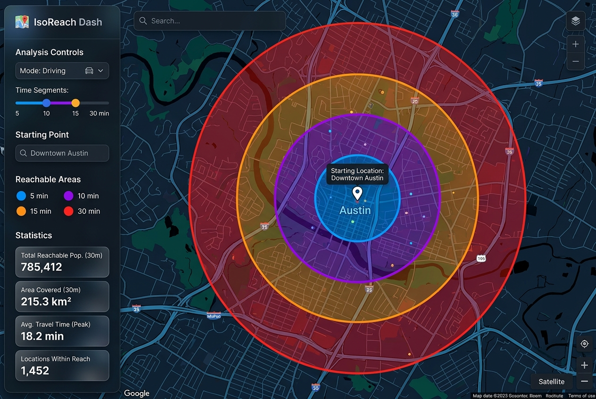

# Google Maps Platform Isochrones Demo



This Vite + Node demo turns the Google Maps Platform Isochrones API into a
practical meet-in-the-middle finder:

- Set two starts by Places search, browser location, or map tap.
- Generate one equal-time travel area for each person by driving, biking, or walking.
- Search Places (New) near the midpoint, then keep only coffee, food, drinks,
  or parks whose coordinates fall inside both isochrones.
- Open any shared result in Google Maps.

The two travel areas are generated in parallel only when requested, which keeps
quota use predictable. A mobile bottom sheet can collapse so the full map stays
available for panning and selecting points.

## Prerequisites

- Node.js 20 or newer.
- Google Maps Platform API keys. For security best practices:
  - **Browser Key** (`VITE_GMP_API_KEY`): Used to load the Maps JavaScript API, Places API (New), and Places UI Kit. This should be restricted by HTTP referrer in your Google Cloud console.
  - **Server Key** (`GMP_SERVER_API_KEY`): Used for backend requests to the Isochrones API. This should be unrestricted or IP-restricted.

### Environment setup

Create a `.env` file in this directory with the following variables:

```dotenv
# Browser key (restricted by HTTP Referrer for localhost)
VITE_GMP_API_KEY=YOUR_GOOGLE_MAPS_BROWSER_KEY

# Server key (unrestricted or IP-restricted to proxy requests)
GMP_SERVER_API_KEY=YOUR_GOOGLE_MAPS_SERVER_KEY
```

Make sure the Google Maps Platform products are enabled on the project(s) corresponding to your keys:
- Maps JavaScript API, Places API (New), and Places UI Kit for the browser key
- Isochrones API (for the server key)

## Run locally

```bash
cd demos/isochrones
npm install
npm run dev
```

Open `http://localhost:5174`.

## Build and preview

> [!IMPORTANT]
> Vite replaces `import.meta.env` variables statically at build time. Therefore, the `.env` file must be present before running the build command, or you must specify `VITE_GMP_API_KEY` inline during the build.

```bash
cd demos/isochrones
# Build compiles static assets with the browser key
npm run build

# Preview runs the local Node.js proxy server with the server key
npm run preview
```

The app calls the Isochrones REST endpoint through `server.js` at `/api/isochrone`. This avoids browser CORS limitations for REST web services and keeps request validation in one local demo proxy.

## Notes

- Drive mode is capped at 60 minutes by the Isochrones API; the server validates this before proxying.
- Coordinates are validated in the browser and server before rendering or sending requests. Nearby Search is capped at its documented 50 km radius and returns at most 20 candidates before overlap filtering.
- The large result popup uses the experimental, pre-GA Places UI Kit Place Details element. The result list and direct Google Maps links remain available if that component changes or is unavailable.
- The demo uses Map ID `556022f677234497` for Advanced Marker support in local prototyping.
