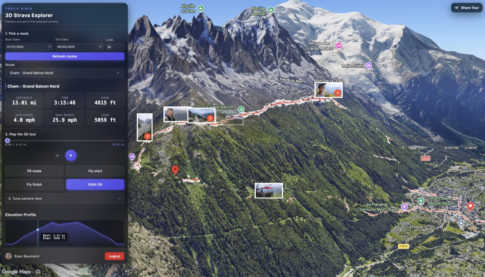
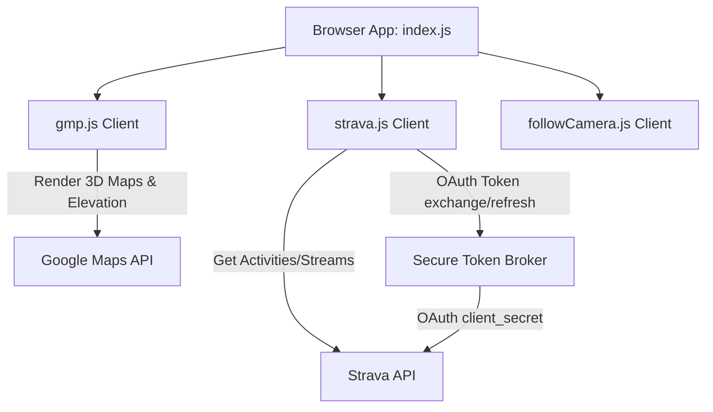

# Strava 3D Explorer



A lightweight, browser-based web application to connect your Strava account, retrieve recent activities, and visualize their routes on a Google Maps Platform Photorealistic 3D globe. The app features an interactive follow-camera tour that lets you review routes and activity photos from a scenic 3D perspective.

## Features

*   **Strava Integration**: Authenticate via Strava OAuth2 to fetch your recent activities.
*   **3D Route Visualizer**: Renders routes as terrain-clamped 3D polylines over photorealistic 3D maps.
*   **Activity Photos**: Displays activity-linked photos as map-anchored 3D billboard markers.
*   **Interactive Camera**: Shortcuts for camera control including flight paths, orbits, and follow-camera flythroughs.
*   **Elevation Profile**: Displays an interactive elevation chart synchronized with the map location.

## Architecture

The application is structured into modular client files and a backend broker (Node.js for development / Cloud Run for production) to securely handle authentication without exposing secrets:



### Key Modules:
*   **`index.js`**: Core UI controller, coordinates events, stats display, and updates the elevation profile widget.
*   **`gmp.js`**: Manages Google Maps Platform 3D map initialization, polyline rendering, and custom 3D photo markers.
*   **`followCamera.js`**: Drives the follow-camera tour, smooth drone physics (inertia), and photo popover triggers.
*   **`geo.js`**: Pure mathematical and geospatial functions (haversine distance, bearing, downsampling, and path smoothing).
*   **`units.js`**: Centralized unit formatting and constants.
*   **`latlng.js`**: Coordinate extraction utility.
*   **`log.js`**: Development-safe logging utility.

## Prerequisites

Before running the application, you need:
*   [Node.js](https://nodejs.org/) (version 20 or newer).
*   A Strava API Application (obtainable via [Strava API settings](https://www.strava.com/settings/api)).
*   A Google Cloud Project with billing enabled and the following APIs active:
    *   Maps JavaScript API (weekly or beta channel)
    *   Map Tiles API (for Photorealistic 3D Tiles)
    *   Elevation API

## Getting Started

1.  **Clone the repo and install dependencies**:
    ```bash
    cd demos/strava-explorer
    npm install
    ```

2.  **Configure environment variables**:
    Create a `.env.development` file in the `demos/strava-explorer` directory:
    ```dotenv
    VITE_STRAVA_CLIENT_ID=YOUR_STRAVA_CLIENT_ID
    VITE_STRAVA_REDIRECT_URI=http://localhost:5173/
    VITE_GMP_API_KEY=YOUR_GOOGLE_MAPS_BROWSER_KEY
    ```
    Also configure local Node development credentials for the broker in `.env.development.local` (not loaded into the browser):
    ```dotenv
    STRAVA_CLIENT_ID=YOUR_STRAVA_CLIENT_ID
    STRAVA_CLIENT_SECRET=YOUR_STRAVA_CLIENT_SECRET
    ```
    *(Note: The client application never receives `STRAVA_CLIENT_SECRET`. During local development, the Vite dev server acts as the token broker. For production, see [HOSTING.md](HOSTING.md) to configure the secure Cloud Run OAuth broker).*

3.  **Run the development server**:
    ```bash
    npm run dev
    ```
    Open the address printed in the terminal (usually `http://localhost:5173`) to view the application.

## Cost Note

> [!NOTE]
> Google Maps Platform usage may incur costs. Consider using the free Maps Demo Key for local prototyping and exploration: [Google Maps Platform Demo Keys](https://mapsplatform.google.com/maps-demo-key).

## Security Best Practices

*   **No Client Secret in Browser**: The application does not expose `STRAVA_CLIENT_SECRET` to the client. The client always uses a broker endpoint (`/api/strava/token`, `/api/strava/refresh`) which handles the client secret securely in Node.js (in dev mode) or on Cloud Run (in production).
*   **OAuth Scope Minimization**: The application requests only the `activity:read_all` OAuth scope. It does not request `read_all` because it does not read private segments or routes, minimizing the risk of over-permissioning.
*   **LocalStorage Token Storage Tradeoff**: Access and refresh tokens are stored in the user's browser `localStorage` to persist the session. While this simplifies integration, it carries a risk of token theft if a Cross-Site Scripting (XSS) vulnerability exists. To mitigate this threat model, enforce a strict Content Security Policy (CSP) and do not load untrusted third-party scripts.
*   **Restrict Google Maps API Keys**: Restrict your Google Maps browser API keys by referrer (e.g. `http://localhost:5173/*` and your production domain) and limit the key's scope to only the necessary APIs.

## Terms of Service & Compliance

This project integrates third-party APIs. By using this application, you must comply with:
*   **Google Maps Platform Terms**: Subject to the [Google Maps Platform Terms of Service](https://cloud.google.com/maps-platform/terms). End users are bound by the [Google Maps End User Additional Terms of Service](https://maps.google.com/help/terms_maps.html) and [Google Privacy Policy](https://policies.google.com/privacy).
*   **Strava API Terms**: Subject to the [Strava Developer Agreement](https://www.strava.com/legal/api). In particular, user/athlete activity data must only be stored in memory or local storage, and never cached on a server for more than 7 days.
*   **Brand Compliance**: This application adheres to the Strava brand guidelines. All activity displays include the "Powered by Strava" branding or logo elements.

## Contributing

Contributions are welcome! Please submit a pull request or open an issue on GitHub. Keep changes simple, self-contained within this directory, and tested locally.

## License

This project is licensed under the [MIT License](LICENSE).
